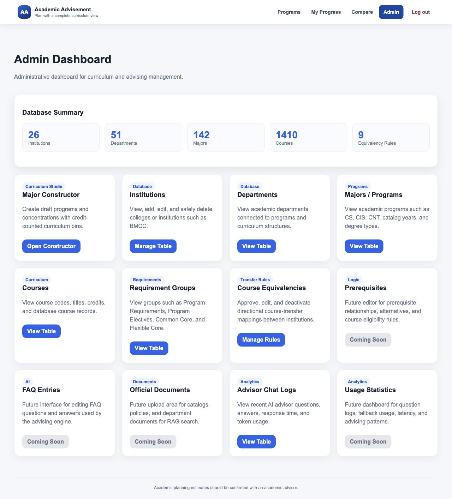
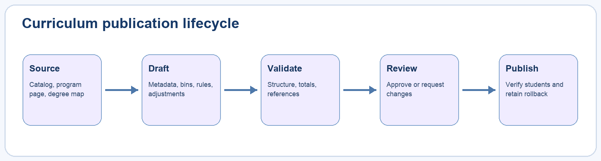
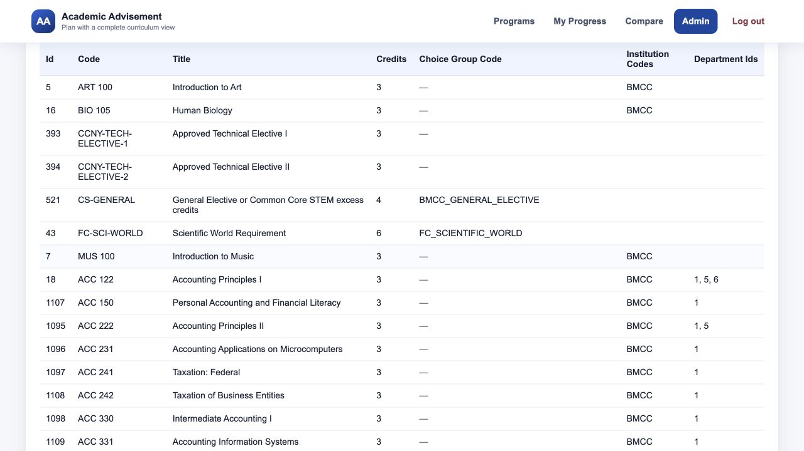
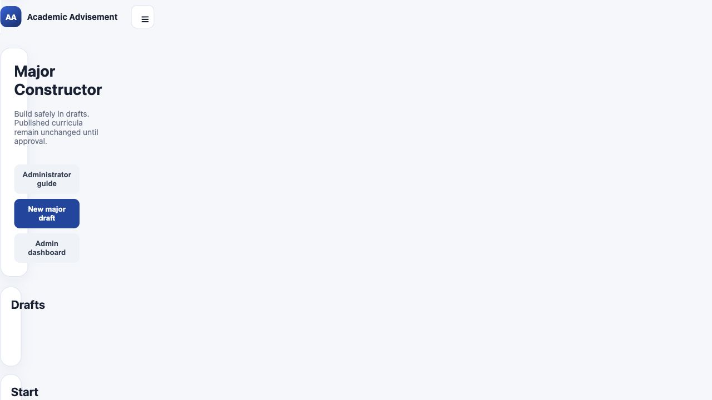
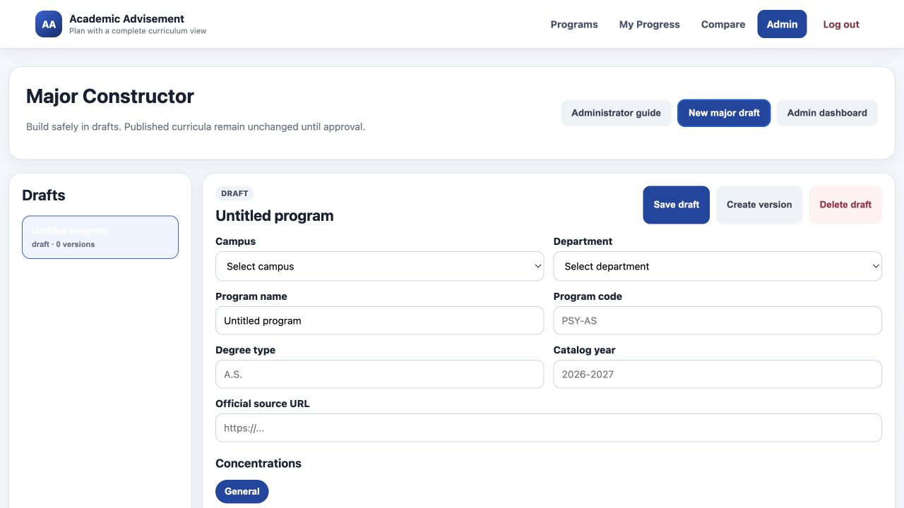
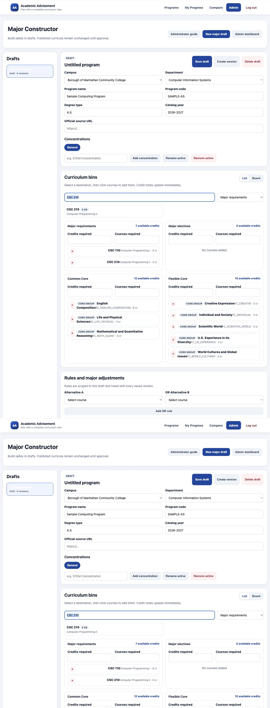
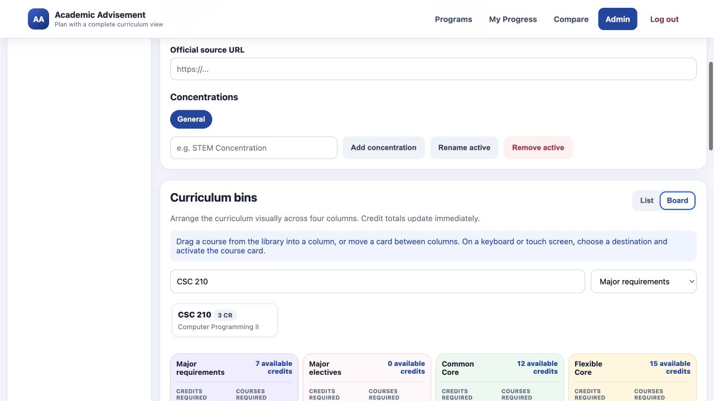
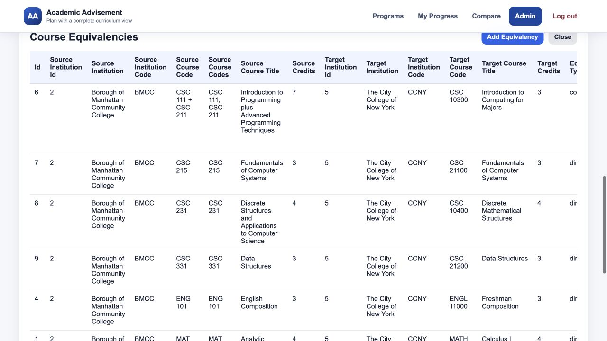
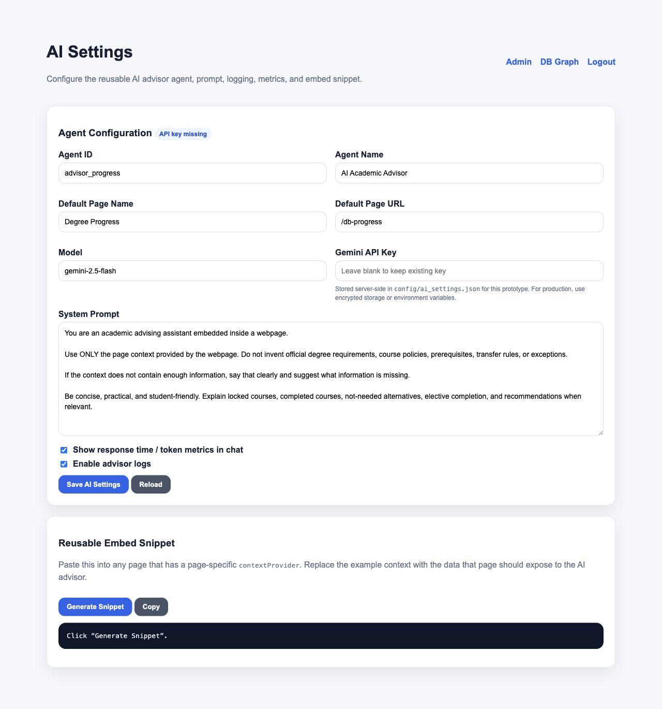

# Administrator Guide: Academic Advisement System

**Illustrated curriculum-management and operations manual**  
Version 1.1 | Academic Advisement System prototype

This guide covers role-based access, database inspection, Major Constructor drafts, curriculum bins, alternatives, prerequisites, elective pools, Core adjustments, preview, validation, review, publication, equivalencies, AI settings, and quality assurance.

> **Change-control rule:** Treat every published curriculum as institutional data. Use official sources, keep drafts reviewable, validate before approval, and preserve a rollback path.

<!-- PAGEBREAK -->

## 1. Administrator responsibilities

Administrators maintain the application representation of academic policy. Typical responsibilities include:

- Managing institutions, departments, programs, courses, and requirement groups.
- Creating and reviewing program drafts.
- Translating official requirements and footnotes into machine-enforced rules.
- Maintaining course equivalencies with provenance and status.
- Verifying student-facing selectors, modals, progress, and plans.
- Configuring the AI advisor without weakening source restrictions.
- Reviewing logs and identifying data-quality or usability problems.

An administrator should not invent missing curriculum rules. Mark uncertain values for review and cite the official catalog, department page, degree map, or articulation source.

<!-- PAGEBREAK -->

## 2. Sign in and verify administrator access

1. Open the login page.
2. Enter the administrator credentials.
3. Select **Log In**.
4. Confirm that **Admin** appears in the main navigation.
5. Open **Admin** and verify the dashboard loads.

The default local account is `admin` / `admin`. Override `APP_USERNAME`, `APP_PASSWORD`, and `SESSION_SECRET` in hosted environments.

Administrative access is enforced server-side. Hiding the navigation alone is not considered authorization.

Use a tester account for student-experience verification so an administrator-only link or API dependency does not accidentally enter the student workflow.

<!-- PAGEBREAK -->

## 3. Read the Admin Dashboard

The dashboard groups tools by operational purpose:

- **Major Constructor** for draft-based curriculum authoring.
- **Degree Tree Constructor** for prerequisite, corequisite, and recommended-sequence relationships.
- **Institutions** and **Departments** for organizational records.
- **Majors / Programs** and **Courses** for catalog data.
- **Requirement Groups** for curriculum structure.
- **Course Equivalencies** for transfer rules.
- **Advisor Chat Logs** for AI interaction review.
- Future cards identify planned but unavailable interfaces.

Check the database summary before large edits. Unexpectedly low counts can indicate a failed seed or incorrect database connection.

<!-- PAGEBREAK -->

## 4. Inspect database tables safely

Dashboard table views help administrators audit the live records without editing CSV files blindly.

When inspecting a course, verify:

- Institution
- Course code and normalized display code
- Title
- Credits
- Department relationships
- Placeholder or choice-group code when applicable

For programs and requirements, verify catalog year, degree type, group category, credit target, ordering, and official source.

Avoid deleting records that may be referenced by programs, drafts, prerequisites, alternatives, or equivalencies. Prefer deactivation or a new catalog version when historical data must remain reproducible.

<!-- PAGEBREAK -->

## 5. Start a Major Constructor draft

1. Open **Major Constructor**.
2. Review the existing draft list.
3. Select **New major draft**.
4. Confirm the new item appears with `draft` status.
5. Enter metadata before adding large numbers of courses.

Drafts isolate work from published curricula. Creating or saving a draft should not alter the student selector.

Use a descriptive draft name early. Avoid multiple indistinguishable **Untitled program** records because reviewers cannot tell which draft is current.

<!-- PAGEBREAK -->

## 6. Enter program metadata

Complete these fields:

- **Campus** - controls course availability and default Core groups.
- **Department** - organizes the program and prioritizes course search.
- **Program name** - student-facing official name.
- **Program code** - stable internal code.
- **Degree type** - for example A.A., A.S., A.A.S., B.A., or B.S.
- **Catalog year** - the authoritative curriculum period.
- **Official source URL** - department, catalog, or program requirements page.

After selecting a campus, verify that only that campus's courses are available. If the campus changes later, re-audit every course and rule.

<!-- PAGEBREAK -->

## 7. Represent concentrations

Use concentration tabs when one program has distinct named curricula.

1. Keep **General** only when it is an actual general pathway.
2. Enter the concentration name and select **Add concentration**.
3. Use **Rename active** for corrections.
4. Use **Remove active** only after verifying that no required content will be lost.

For student-facing clarity, separate concentrations may also be published as distinct program choices when they have materially different requirements, such as Psychology General and Psychology STEM.

Do not create a concentration merely for an informal recommendation. The name and requirements should be supported by an official source.

<!-- PAGEBREAK -->

## 8. Understand the four curriculum bins

The constructor uses four destination bins:

- **Major requirements** - specifically required curriculum courses.
- **Major electives** - controlled pools or elective placeholders.
- **Common Core** - required Pathways categories or institution-specific equivalents.
- **Flexible Core** - approved Flexible Core areas.

Each bin tracks available credits plus required credit and course counts. The count at the top is a validation aid, not a substitute for checking official totals.

Campus selection can prepopulate Common and Flexible Core groups. Administrators then add program-specific adjustments rather than rebuilding canonical pools for every major.

<!-- PAGEBREAK -->

## 9. Add courses in List view

1. Select the destination bin.
2. Search by course code or title.
3. Confirm the course belongs to the selected campus.
4. Select the course card to add it.
5. Review the bin's credit total.
6. Remove incorrect cards with the remove control.

The search ranks the selected department's courses first but still permits relevant courses from other departments at the same campus.

Add placeholders only when they connect to a non-empty choice group. A selectable placeholder with no group code produces an incomplete student selector.

<!-- PAGEBREAK -->

## 10. Use Board view

Select **Board** to display all four bins in a compact visual workspace. Drag course cards from the course library into a destination bin or between bins.

Use Board view for curriculum organization and comparison. Use List view when entering detailed credit targets or reviewing long course titles.

During dragging:

- The target bin changes color.
- The dragged card reflects the prospective destination.
- All four pastel-colored bins remain visible on a standard desktop width.

After a drag, verify the destination and the updated credit count. A visual move does not replace rule creation when the course is part of an alternative or elective pool.

<!-- PAGEBREAK -->

## 11. Create `OR` alternatives

Use an alternative rule when the official curriculum says one course **OR** another course satisfies one requirement.

1. Add both courses to an appropriate curriculum bin.
2. Choose **Alternative A**.
3. Choose **OR Alternative B**.
4. Select **Add OR rule**.
5. Preview the student interface.

Expected student behavior:

- Both options appear in one clearly grouped card or dialog.
- Selecting one marks the other as not needed or unavailable.
- The requirement receives credit only once.

Do not use an `OR` rule for a multi-course elective pool or a recommended course.

<!-- PAGEBREAK -->

## 12. Create prerequisites and sequences

Use a prerequisite rule when one selected course must be completed before another becomes available.

1. Add both courses to the curriculum.
2. Choose the dependent course under **Course**.
3. Choose the prerequisite under **Requires**.
4. Select **Add prerequisite**.
5. Preview both locked and unlocked states.

For alternative prerequisites or sequences, reproduce the official logic precisely. Do not infer prerequisites solely from a degree-map order; confirm them in an authoritative catalog or course source.

A course selected as completed should synchronize across every requirement location, and dependent courses should update immediately.

<!-- PAGEBREAK -->

## 13. Create an elective pool

Use an elective pool when students choose from multiple approved courses.

Define:

- A clear student-facing pool name.
- The destination bin.
- Credits required.
- Courses required when the rule specifies a count.
- Every approved course in the pool.
- Additional level, subject, or distribution rules when supported.

Only courses participating in the curriculum should be available to rule selectors. This prevents a hidden course from affecting a visible requirement.

Test the pool below, at, and above the selection limit. Confirm that a student can replace an existing choice but cannot overfill the requirement.

<!-- PAGEBREAK -->

## 14. Configure Common and Flexible Core adjustments

The target architecture uses:

1. One canonical base-membership group for each Core area.
2. A program adjustment only when the major differs from the base pool.
3. Program CSV rows that reference base or derived choice-group codes.

In the adjustment editor:

- Select the base Core group.
- Select the placeholder requirement.
- Override credits or course count only when required.
- Limit allowed subject prefixes when the official rule does so.
- Include or exclude specific selected courses.
- Write a concise student-facing adjustment note.

The note should translate the rule, not reproduce an unreadable footnote.

<!-- PAGEBREAK -->

## 15. Preview and validate

Select **Preview major** to inspect the same bin structure students will receive. Then select **Validate**.

Validation should catch:

- Missing campus, department, code, degree type, or catalog year.
- Empty required bins.
- Credit totals that do not match the declared requirement.
- Placeholder requirements with missing or empty groups.
- Rules referencing courses outside the curriculum.
- Invalid alternatives or prerequisites.
- Duplicate or conflicting program identity.

Validation success means the draft is structurally consistent; it does not prove that it matches policy. Complete an official-source audit before review.

<!-- PAGEBREAK -->

## 16. Build and verify a Degree Map Tree

Use **Degree Tree Constructor** at `/admin/curriculum-graph` after curriculum membership has been defined in Major Constructor.

1. Select the campus and program.
2. Confirm that the preview contains the expected required courses and folded requirement-category cards.
3. Import either the program curriculum CSV or the compact relationship template.
4. Review parsed relationships and warnings before saving.
5. For a manual relationship, drag the earlier course and dependent course into the relationship wells.
6. Choose prerequisite, corequisite, or recommended sequence, and assign the correct AND/OR group.
7. Save the override and reopen the student-facing tree to verify it.
8. Use **Reset** to remove an override and restore the canonical CSV-derived relationship.

Source precedence is deliberate: explicit program CSV relationships win, campus-wide prerequisites fill only undeclared cases, and saved administrator overrides are applied last. This keeps the course selector and tree aligned while preserving reversible local corrections.

Do not use the tree constructor to add a course to a major or move it between curriculum bins. Make those changes in Major Constructor, validate the curriculum, and then return to the tree to edit relationships.

<!-- PAGEBREAK -->

## 17. Review, approve, publish, and roll back

The intended lifecycle is:

1. Save the working draft.
2. Create a version at a meaningful checkpoint.
3. Validate.
4. Submit for review.
5. Approve or request changes.
6. Publish only an approved version.
7. Verify the student selector and progress page.
8. Roll back if a published defect is found.

Separate authoring from approval whenever possible. Record the official source and review notes so another administrator can reconstruct the decision.

<!-- PAGEBREAK -->

## 18. Maintain course equivalencies

Course equivalencies are directional and institution-specific. A complete record can include:

- Source and destination institutions.
- One source course for a direct equivalency.
- Multiple source courses for a combination equivalency.
- Destination course.
- Minimum grade.
- Catalog-year bounds.
- Status such as draft, approved, inactive, or superseded.
- Official articulation source and notes.

Never infer equivalence from matching course numbers or similar titles. Keep unverified mappings out of approved student calculations.

<!-- PAGEBREAK -->

## 19. Configure the AI advisor

Open **AI Settings** to configure:

- Agent ID and student-facing name.
- Default page name and URL.
- Gemini model.
- API key or environment-based key.
- System prompt.
- Metrics visibility.
- Advisor logging.
- Reusable embed snippet.

The prompt should require the advisor to use only page context, identify missing information, and avoid inventing requirements, exceptions, transfer rules, or guarantees.

Store production secrets in environment variables or an appropriate secrets service. Do not commit real keys.

<!-- PAGEBREAK -->

## 20. Regression testing checklist

Before publishing curriculum or platform changes:

- Run the automated test suite.
- Seed a clean local database.
- Verify no duplicate program appears in the selector.
- Confirm established majors retain their previous requirements and pools.
- Test a new student and a student with completed coursework.
- Test locked prerequisites and alternative synchronization.
- Test elective limits and requirement-satisfied states.
- Test Writing Intensive confirmation.
- Generate and inspect a degree-plan PDF.
- Test major-change and transfer comparison.
- Sign in as tester and confirm admin access is unavailable.

Use a representative mature program, such as Computer Science, as a regression baseline.

<!-- PAGEBREAK -->

## 21. Data-source and audit checklist

For every new or modified program, preserve:

- Official program requirements URL.
- Official catalog or SmartCatalog URL when available.
- Degree-map PDF in project assets.
- Catalog year and degree type.
- Footnote-by-footnote interpretation.
- Program requirements and electives.
- Core adjustments.
- Alternatives and prerequisites.
- Elective pool membership and limits.
- Course equivalency sources.

If sources conflict, stop publication and request department clarification. A technically valid draft can still be academically incorrect.

<!-- PAGEBREAK -->

## 22. Incident response and rollback

When a published defect is reported:

1. Reproduce it with the same campus, program, and catalog year.
2. Determine whether the problem is data, rule logic, UI, authentication, or deployment.
3. Record screenshots and exact expected behavior.
4. Protect students from the incorrect result with a rollback or deactivation.
5. Correct the smallest authoritative source layer.
6. Add or update an automated regression test.
7. Reseed and retest affected and baseline majors.
8. Publish through the normal approval workflow.

Do not overwrite historical curriculum merely to repair the newest version.

<!-- PAGEBREAK -->

## Administrator quick reference

| Task | Primary tool | Required verification |
|---|---|---|
| Inspect data | Dashboard table | Institution, code, credits, references |
| Create a major | Major Constructor | Metadata and official source |
| Add courses | List or Board | Campus, bin, totals |
| Create alternatives | OR rule | Mutual exclusion in preview |
| Create prerequisites | Prerequisite rule | Locked and unlocked states |
| Create electives | Elective pool | Membership and limits |
| Adjust Core | Core adjustment | Base group, overrides, note |
| Publish | Review workflow | Validation, approval, student regression |
| Add transfer mapping | Equivalencies | Direction, source, status |
| Configure AI | AI Settings | No invented policy, secrets protected |
| Investigate defect | Logs and reproduction | Minimal fix plus regression test |

Publish only what can be traced to an authoritative source and reproduced by another reviewer.
