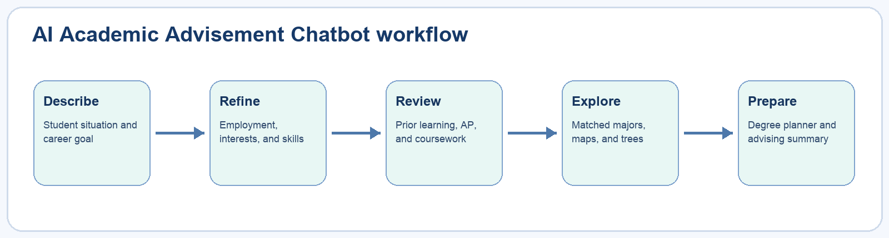

# AI Academic Advisement Chatbot Guide

**Student, tester, and administrator manual**  
Version 1.0 | Academic Advisement System prototype

This guide explains how to use and demonstrate the public AI Academic Advisement Chatbot. It covers conversational onboarding, career-to-major matching, skills, prior learning, AP credit estimates, transcript review, degree maps, Degree Map Trees, and the handoff to the interactive degree planner.

> **Important:** The chatbot is a pre-advisement tool. It does not make admission, transfer-credit, graduation, licensure, registration, or employment decisions. Official college sources and authorized advisors remain authoritative.

<!-- PAGEBREAK -->

## 1. Open the chatbot

Open the application's main web address. The chatbot is the public landing page and does not require an account.

The header displays the BMCC and AI Tech Innovation Hub logos. Each logo links to its respective official website. The central conversation area contains assistant messages, quick-choice tags, and a free-text field for every question.

Do not enter a Social Security number, full CUNY ID, password, medical record, immigration document number, or other sensitive information. The chatbot does not need this information to suggest an academic starting point.

The authenticated degree-planning application remains separate. A student signs in only when the planner requires an authenticated session.

<!-- PAGEBREAK -->

## 2. Identify your student situation

The first question asks, **What best describes you?** Choices are visually divided into two groups.

**New or prospective students** may include high-school students, adult learners, people with some college experience, transfer students, returning students, and people who already hold a degree.

**Current students** may include current BMCC or other CUNY students exploring their present program, a major change, transfer planning, or next steps.

Select the closest quick-choice tag or describe your situation in the free-text field. Select **Submit** to continue. The selected situation helps the chatbot frame later recommendations but does not change an official student record.

<!-- PAGEBREAK -->

## 3. Describe the work you want to do

Enter a career goal such as `Data Analyst`, `Registered Nurse`, `Software Developer`, `Accounting Clerk`, `Case Manager`, or `Urban Planner`.

You can use a suggested tag, search the reviewed career list, or type your own answer. With AI assistance enabled, the chatbot interprets ordinary wording and common job-title variations. Recommendations still come from reviewed career-to-program mappings; the system does not invent a program match for an unsupported occupation.

If the goal is not recognized, open the reviewed career browser or try a more specific job title. A safe no-match message means the taxonomy needs expansion or the goal should be discussed with an advisor.

<!-- PAGEBREAK -->

## 4. Add employment context and skills

Answer whether you currently have a job and briefly describe relevant experience when useful.

The chatbot then proposes skills related to the career goal. Select up to five relevant skills using the quick tags, and add a skill in free text when it is not listed. Examples include working with numbers, helping people, programming, communicating ideas, organizing projects, writing, research, and problem solving.

Choose skills you genuinely have or want to develop. The matching explanation separates career evidence from selected-skill evidence, so the tags refine a recommendation instead of replacing the career goal.

Use **Back** to correct an earlier answer or **Start over** to clear the current browser draft.

<!-- PAGEBREAK -->

## 5. Report possible prior learning

Select every category that may apply:

- Previous college courses
- AP or other recognized examinations
- Employer or industry training
- ACE/NCCRS evaluated learning
- Military learning
- Licenses or certifications
- Language proficiency
- Portfolio or documented experience

These answers identify possible Credit for Prior Learning or transfer-review opportunities. They do not award credit automatically. The final summary provides a document checklist and official next steps for evaluation.

If none applies, select the corresponding option and continue.

<!-- PAGEBREAK -->

## 6. Enter AP examinations

When you report AP or recognized examinations, enter each AP subject and score.

1. Choose the examination.
2. Select the score shown on the official score report.
3. Select **Add exam**.
4. Review the displayed BMCC equivalency and estimated credits.
5. Remove and re-enter an examination if the subject or score is incorrect.

The estimate uses the published BMCC Credit for Prior Learning table. An entry containing multiple possible course outcomes remains subject to official evaluation and may not be applied automatically in the planner.

Keep the official score report for Admissions, the Registrar, or the designated evaluator.

<!-- PAGEBREAK -->

## 7. Upload and review previous coursework

The chatbot accepts a PDF, JPG, or PNG transcript or score report for planning assistance.

1. Select the file.
2. Choose **Analyze document**.
3. Wait for the extracted draft table.
4. Review institution, course code, title, credits, and grade row by row.
5. Correct a recognized course code when needed.
6. Clear **Use** for any uncertain or incorrectly extracted row.

AI extraction can be incomplete or inaccurate. The table is a review draft, not an official transfer-credit decision. Courses from another college remain pending until an authorized evaluator confirms the equivalent BMCC course.

<!-- PAGEBREAK -->

## 8. Use reviewed courses in the degree planner

After reviewing the transcript table, select **Use reviewed courses in degree planner**.

A medium-size planner window opens with the completed-course selector. Recognized BMCC courses and unambiguous published AP equivalents are preselected and visually identified as imported suggestions. Review every imported selection before relying on the progress totals.

If a course does not belong to the selected program, has no approved equivalency, or cannot be matched confidently, it stays in the transfer-review snapshot instead of being checked automatically.

Close the window to return to the chatbot. The reviewed import remains a planning aid and does not alter CUNYfirst, DegreeWorks, or the official transcript.

<!-- PAGEBREAK -->

## 9. Read the recommended-major cards

After completing the questions, the chatbot can display up to three reviewed academic starting points. Each card may contain:

- Program name, degree, department, and catalog year
- Fit score and plain-language evidence
- Career and selected-skill score components
- Important transfer, licensure, or education warnings
- Official BMCC program source
- Official degree-map PDF when available
- **Open interactive degree planner**
- **Degree Map Tree**

The first card is not an admission decision or a command to change majors. Compare the explanations, review the official sources, and discuss the result with an advisor.

<!-- PAGEBREAK -->

## 10. Use the degree map, tree, and planner

Use the three views for different questions:

| View | Best use |
|---|---|
| Official degree map | See the published semester pattern and source document. |
| Degree Map Tree | Understand prerequisites, alternatives, elective groups, and courses unlocked later. |
| Interactive degree planner | Mark completed courses, inspect remaining requirements, and build a tentative plan. |

In the Degree Map Tree, open folded Common Core, Flexible Core, and Program Elective cards only when you need their choices. Select a course to expand it and highlight the later pathway in green.

In the planner, confirm that the campus, program, and catalog year match the recommendation before selecting completed coursework.

<!-- PAGEBREAK -->

## 11. Prepare an advising summary

At the end of the workflow, review the pre-advisement summary. It may include the student situation, career goal, selected skills, program matches, possible prior-learning categories, transfer information, and a schedule checklist.

Download or copy the summary for an advising meeting. Provide name, email, optional last four ID digits, and consent only when intentionally preparing a referral.

Before meeting an advisor, bring the official transcript, examination score report, prior-learning documentation, and a list of questions. Do not treat a downloaded chatbot summary as an official evaluation.

<!-- PAGEBREAK -->

## 12. Reproducible demonstration

Use this sequence for a short classroom or faculty demonstration:

1. Open the main application address in a private browser window.
2. Choose **High-school student**.
3. Enter `Data Analyst` as the career goal.
4. Select **No** for current employment.
5. Select skills such as working with numbers, problem solving, research, and technology.
6. Select **None of these** for prior learning.
7. Submit the final answer and review the program recommendations.
8. Open an official program page, the Degree Map Tree, and the interactive degree planner from a recommendation card.

Expected result: the chatbot recognizes the reviewed career, presents sourced BMCC starting points with explanations, and provides direct academic-planning actions.

Repeat with `Registered Nurse`, `Accounting Clerk`, `Case Manager`, or `Software Developer` to demonstrate different program families.

<!-- PAGEBREAK -->

## 13. Accessibility and troubleshooting

Quick-choice tags and controls are keyboard operable. Use Tab to move, Enter or Space to activate a choice, and the visible focus indicator to track position. The conversation automatically scrolls so the current question remains visible.

**No reviewed match appears:** Search the reviewed career list or enter a more specific occupation.

**AI assistance fails:** The deterministic reviewed taxonomy should remain available. Ask the administrator to verify the server-side AI key and logs.

**Transcript analysis fails:** Confirm the file is PDF, JPG, or PNG, reduce an unusually large file, and verify the server AI configuration. Never place an API key in browser code.

**Planner does not receive courses:** Recheck the extracted codes, selected program, campus, and whether official equivalencies exist.

**A recommendation seems incorrect:** Save the goal, selected skills, result, and review date, then report them to the administrator for mapping review.

<!-- PAGEBREAK -->

## 14. Administrator operations checklist

Administrators should periodically verify:

- Published careers, aliases, skills, and career-to-program mappings
- Official sources, review dates, explanations, and warnings
- Program curricula and degree-map PDF links
- Prior-learning guidance and AP equivalency tables
- Transfer options and schedule handoff settings
- AI provider configuration and server-side API key status
- Anonymous draft expiration, privacy notices, and referral consent
- Student/tester access to planning pages and protection of administrator endpoints

Use the protected governance interface to draft, review, approve, publish, archive, version, or roll back knowledge records. Public recommendations must expose published data only.

After any data or UI change, repeat the demonstration sequence, test an unknown career, test keyboard navigation, and verify that the chatbot never promises credit, admission, licensure, employment, or course availability.

<!-- PAGEBREAK -->

## Quick reference

| Goal | Action |
|---|---|
| Explore without an account | Open the application's main address. |
| Choose an answer quickly | Select a suggested tag, then Submit. |
| Give a custom answer | Type in the free-text field. |
| Correct the conversation | Use Back or Start over. |
| Estimate published AP credit | Add the AP subject and official score. |
| Review a transcript | Upload PDF/JPG/PNG and verify every extracted row. |
| Apply reviewed suggestions | Open the embedded completed-course planner. |
| Understand sequencing | Open Degree Map Tree. |
| Verify the curriculum source | Open the official program page or degree-map PDF. |
| Prepare for advising | Download the summary and bring official documents. |

Always confirm final academic decisions with an authorized advisor and official college records.
