# Student Guide: Academic Advisement System

**Illustrated step-by-step manual**  
Version 1.0 | Academic Advisement System prototype

This guide explains how a student or tester uses the advising platform from login through program selection, completed-course entry, degree planning, major-change review, transfer analysis, and PDF export. The examples use BMCC Computer Science, but the same workflow applies to other populated programs.

> **Important:** This application is a planning prototype. DegreeWorks, the official college catalog, your academic department, and a professional advisor remain authoritative.

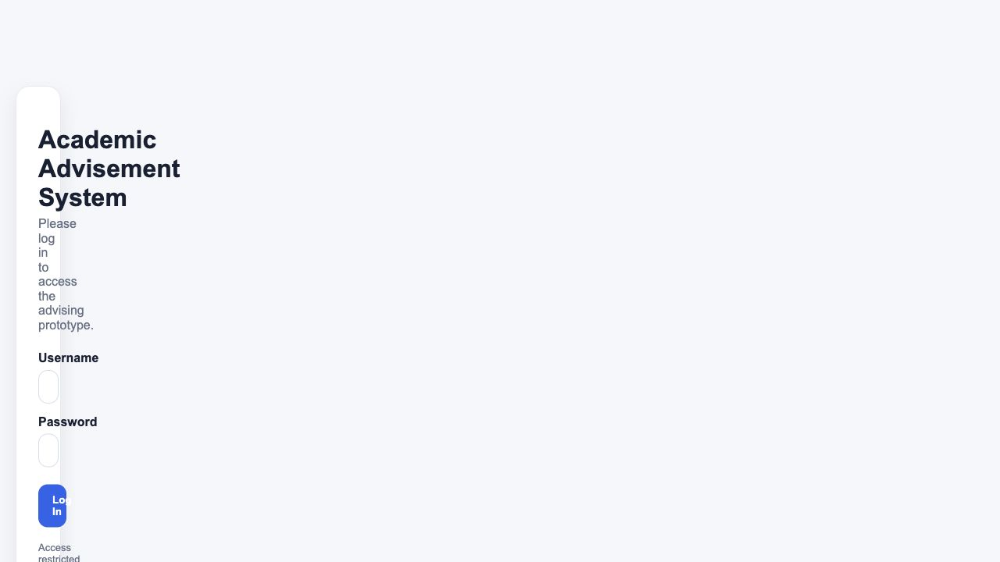

<!-- PAGEBREAK -->

## 1. What the platform helps you do

The platform combines several advising tasks in one workspace:

- Choose a CUNY campus and a populated academic program.
- Record college courses you have already completed.
- Understand prerequisites, alternatives, electives, and Core requirements.
- See degree progress by requirement category.
- Build a tentative semester-by-semester plan.
- Compare another major or a program at another CUNY college.
- Download a degree-plan PDF for discussion with an advisor.
- Ask the AI advisor questions based on the currently displayed curriculum.

The platform does **not** register you for classes, read your official transcript automatically, approve substitutions, guarantee course availability, or certify graduation.

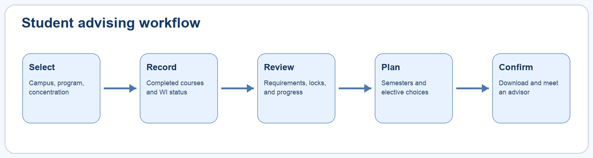

<!-- PAGEBREAK -->

## 2. Before you begin

Have the following information ready:

1. Your current or intended CUNY campus.
2. Your program or major and, when applicable, concentration.
3. Your catalog year if your advisor has identified it.
4. A list of completed college courses, preferably from CUNYfirst or an unofficial transcript.
5. Transfer-course decisions already confirmed by an evaluator.
6. Whether you completed a section officially designated Writing Intensive.

For testing, use the student account supplied by the project administrator. The default local account is `tester` / `tester`. Hosted credentials may be changed through deployment settings.

Use a desktop or laptop for the clearest four-column requirement view. Mobile navigation works, but large course-choice dialogs are easier to review on a wider screen.

<!-- PAGEBREAK -->

## 3. Sign in as a student or tester

1. Open the application URL.
2. Enter the tester username.
3. Enter the tester password.
4. Select **Log In**.
5. Confirm that the navigation contains **Programs**, **My Progress**, **Compare**, and **Log out**.

A tester account intentionally does not display the **Admin** link. Direct requests to administrator pages and administrator APIs are rejected by the server.

If the login is rejected, verify capitalization and confirm that the deployment owner has not changed the demonstration credentials.

<!-- PAGEBREAK -->

## 4. Understand the main navigation

The shared navigation stays available across the student pages:

- **Programs** returns to campus and major selection.
- **My Progress** opens the current completed-course and degree-progress workspace.
- **Compare** opens major-change or transfer comparison when a valid progress snapshot is available.
- **Log out** clears the current authenticated session.

On the progress page, a second action bar provides shortcuts to the AI advisor, degree-plan builder, major-change workflow, transfer analysis, program selection, and detailed progress.

Changing programs can replace the currently active planning context. Download or record any plan you need before starting a different what-if scenario.

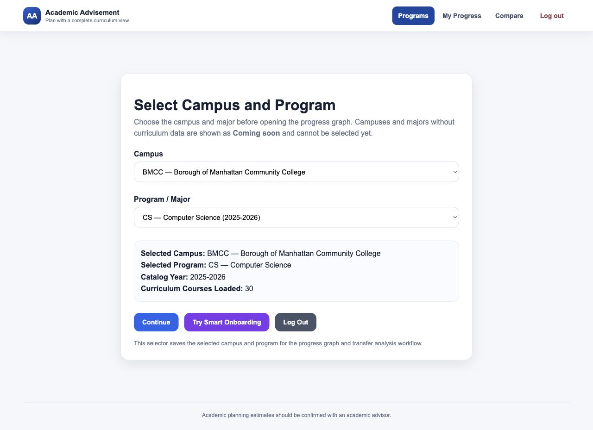

<!-- PAGEBREAK -->

## 5. Select a campus

1. Open **Programs**.
2. Open the **Campus** list.
3. Select the institution where the program is offered.
4. Wait for the program list and summary to refresh.

Campuses marked **Coming soon** are present in institutional data but do not yet have a selectable curriculum. They cannot be used for progress planning.

Course identity is campus-specific. For example, a course code at BMCC and the same visible code at another college are treated as different records unless an equivalency explicitly connects them.

Check the selected-campus summary below the menus before continuing.

<!-- PAGEBREAK -->

## 6. Select a program or concentration

1. Open the **Program / Major** list.
2. Choose the populated program you want to evaluate.
3. Confirm the program name, catalog year, and loaded-course count.
4. Select **Continue**.

Concentrations may appear as separate choices, such as **Psychology - General Concentration** and **Psychology - STEM Concentration**. Select the concentration that matches your official record or the scenario you want to test.

Programs marked **Coming soon** are not selectable because their course requirements are incomplete.

Do not choose a similarly named program at another campus as a substitute. Curricula, course identities, and Core structures may differ.

<!-- PAGEBREAK -->

## 7. Answer the onboarding question

After selecting **Continue**, the application asks whether you have completed college-level coursework.

- Choose **Yes, I have taken college-level classes** to enter completed courses manually.
- Choose **No, this is my first semester** to begin with no completed college coursework.
- Choose **Back** to correct the campus or program.

The answer changes the starting state, not the official student record. You can later return to completed-course entry and make corrections.

For a transfer or returning student, select **Yes** even if only some courses have been evaluated. Enter only courses you can identify confidently and discuss uncertain transfer credit with an advisor.

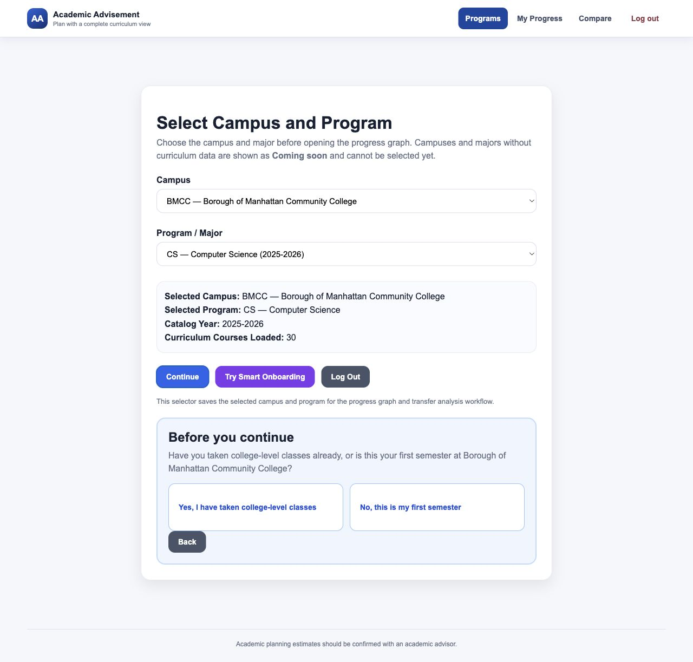

<!-- PAGEBREAK -->

## 8. Read the completed-course workspace

The progress workspace organizes the curriculum into columns or sections:

- **Program Requirements** - named courses required by the program.
- **Program Electives** - approved pools or controlled elective choices.
- **Common Core** - Required Core categories and approved course groups.
- **Flexible Core** - Pathways areas and program-specific adjustments.

The legend distinguishes completed, available, prerequisite-locked, and not-needed states. A gray or locked course is informational and cannot be selected until its conditions are satisfied.

Use **Class details** to inspect titles, credits, prerequisites, or explanatory notes.

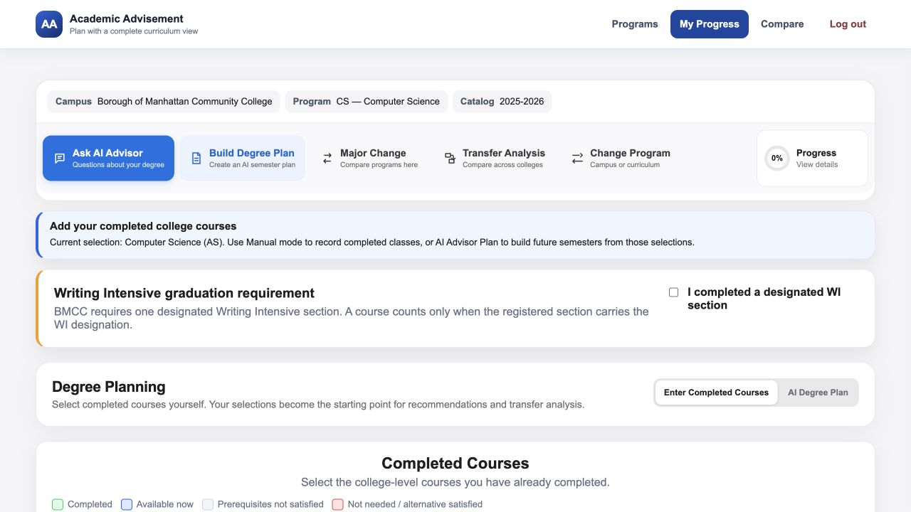

<!-- PAGEBREAK -->

## 9. Enter completed courses accurately

1. Work from an unofficial transcript or another reliable course list.
2. Select each completed course checkbox.
3. Watch dependent courses unlock when prerequisites become satisfied.
4. Review progress after each group of selections.
5. Use **Clear Selection** only when you intentionally want to restart.

Select a course as completed only if you earned credit or have an accepted transfer decision. Do not select planned, in-progress, withdrawn, or merely recommended courses as completed.

When one course legitimately appears in multiple requirement contexts, selecting it in one place synchronizes its completed state. The requirement engine determines where the credit applies; it does not grant duplicate credits.

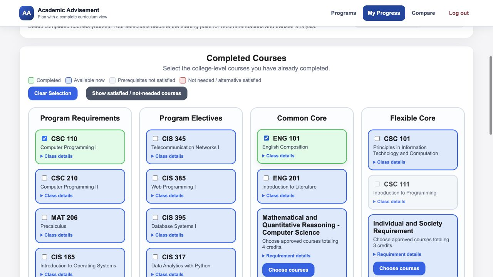

<!-- PAGEBREAK -->

## 10. Understand locked and unavailable courses

A course can be unavailable because:

- A prerequisite has not been selected as completed.
- A prerequisite group is only partly satisfied.
- Another course in an `OR` pair already satisfies the requirement.
- An elective requirement has reached its course or credit limit.
- The course is reserved for another requirement location.
- The course is not needed for the remaining requirement.

Gray styling is not a recommendation to take the course. Open **Class details** for the explanation. If your official record contains an exception, substitution, or waiver that the application does not represent, do not force an inaccurate selection; bring the discrepancy to an advisor.

<!-- PAGEBREAK -->

## 11. Use a Common or Flexible Core choice dialog

Some requirements are represented by a **Choose courses** button rather than one checkbox.

1. Select **Choose courses** for the requirement.
2. Read the major-specific adjustment note near the search field.
3. Review the required credits and course count.
4. Search by course code or title when the pool is large.
5. Review subject or sequence groupings.
6. Select only enabled courses.
7. Close the dialog after the required amount is satisfied.

The dialog can explain why a major narrows the general Pathways pool. For example, Computer Science places a particular mathematics course before the required calculus sequence.

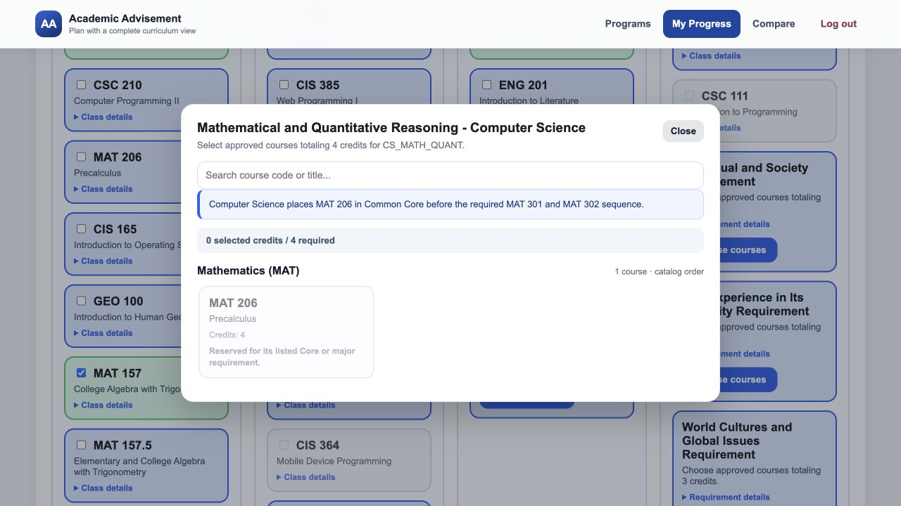

<!-- PAGEBREAK -->

## 12. Understand alternatives and elective pools

An `OR` requirement means one approved alternative satisfies the paired requirement. Both options may initially be visible in one card or dialog. After one is selected, the other becomes not needed or unavailable.

An elective pool is different: it may require several courses, a credit total, a level rule, or a subject-distribution rule. Examples include:

- Choose three approved courses.
- Choose nine credits from a published list.
- Choose two 200-level courses.
- Choose courses from different disciplines.

The application prevents selections beyond machine-enforced limits. It may still display additional eligible courses so that you can replace a choice.

<!-- PAGEBREAK -->

## 13. Confirm Writing Intensive status

BMCC students may see a separate **Writing Intensive graduation requirement** confirmation.

Select the checkbox only if the **section** you completed carried the official WI designation. A course title alone does not prove that every section is Writing Intensive.

If you are unsure:

1. Check your registration history or course section information.
2. Consult the relevant department or advisor.
3. Leave the checkbox unselected until confirmed.

The progress panel tracks this confirmation separately from ordinary course credits.

<!-- PAGEBREAK -->

## 14. Read detailed degree progress

Select the circular **Progress** control to expand category details. The panel shows earned or selected credits compared with each requirement target.

Review each category separately:

- Required Common Core
- Flexible Core
- Curriculum or program requirements
- Program electives
- Writing Intensive confirmation

The overall percentage is a planning estimate derived from the selected curriculum and course states. It is not an official graduation percentage and may not reflect substitutions, residency requirements, minimum grades, repeats, or transfer-credit limitations.

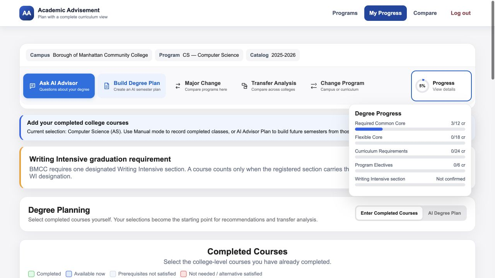

<!-- PAGEBREAK -->

## 15. Switch to AI Degree Plan mode

Under **Degree Planning**, select **AI Degree Plan**. Configure:

1. **Desired completion timeline** - the number of remaining semesters.
2. **Preferred workload pattern** - equal, lighter first, or heavier first.
3. **Target credits per regular semester** - a planning load such as 12 or 15 credits.

The application calculates a tentative sequence using completed courses, prerequisites, curriculum categories, and selected preferences.

If required credits cannot fit, lengthen the timeline or investigate missing prerequisites. An unplaced credit warning is more useful than a plan that silently violates rules.

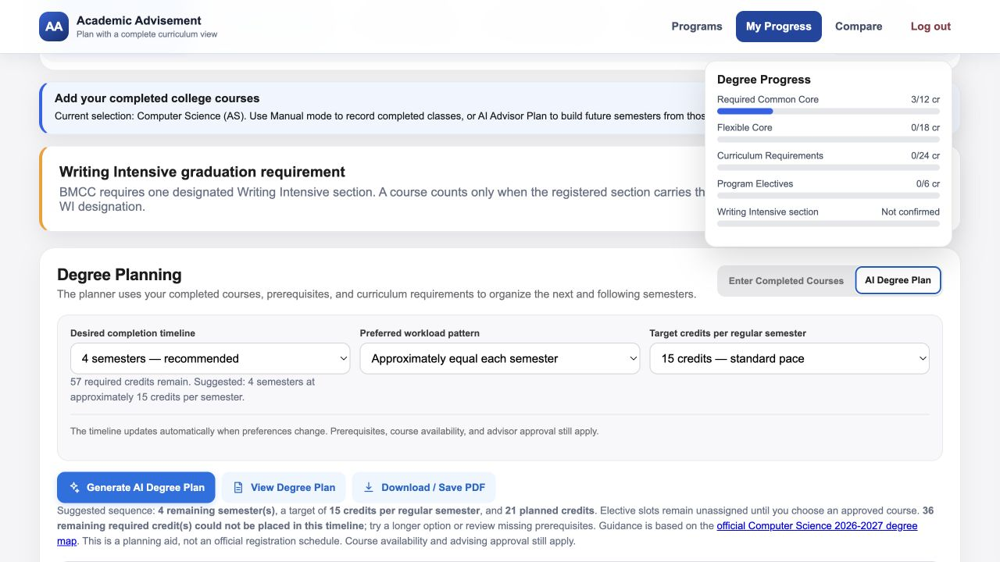

<!-- PAGEBREAK -->

## 16. Review the generated semester plan

Read every semester card before relying on the plan:

- Verify the total credits and course count.
- Confirm prerequisites occur in an earlier semester.
- Identify generic **Elective choice** placeholders.
- Check whether a required course could not be placed.
- Review the linked official degree map.

An elective placeholder is intentionally not filled automatically. Open the corresponding requirement and choose an approved course based on availability, interests, transfer goals, and advisor guidance.

The plan does not guarantee that a course will run in the displayed term or that there will be an available seat.

<!-- PAGEBREAK -->

## 17. Download or save the degree-plan PDF

1. Finish completed-course entry.
2. Open **AI Degree Plan**.
3. Select the desired timeline and workload.
4. Review the generated sequence.
5. Select **Download / Save PDF**.
6. Save the file with a descriptive name that includes the program and date.

Bring the PDF to an advising appointment. It is most useful as a discussion document: mark uncertain electives, transfer courses, prerequisites, and semesters with unusually high credit loads.

Regenerate the plan after changing completed courses or program selections because the earlier PDF does not update automatically.

<!-- PAGEBREAK -->

## 18. Ask the AI advisor a focused question

Select **Ask AI Advisor** to open the advising drawer. The advisor receives the current program and progress-page context.

Good questions include:

- Why is CSC 211 locked?
- Which completed course satisfied this requirement?
- What prerequisite unlocks the most remaining courses?
- Which elective requirement is still incomplete?

Avoid asking the AI to approve substitutions, guarantee transfer credit, or override an official policy. If the page lacks enough information, the correct response is to say what is missing.

AI features require a configured Gemini key. Manual progress and planning remain available without it.

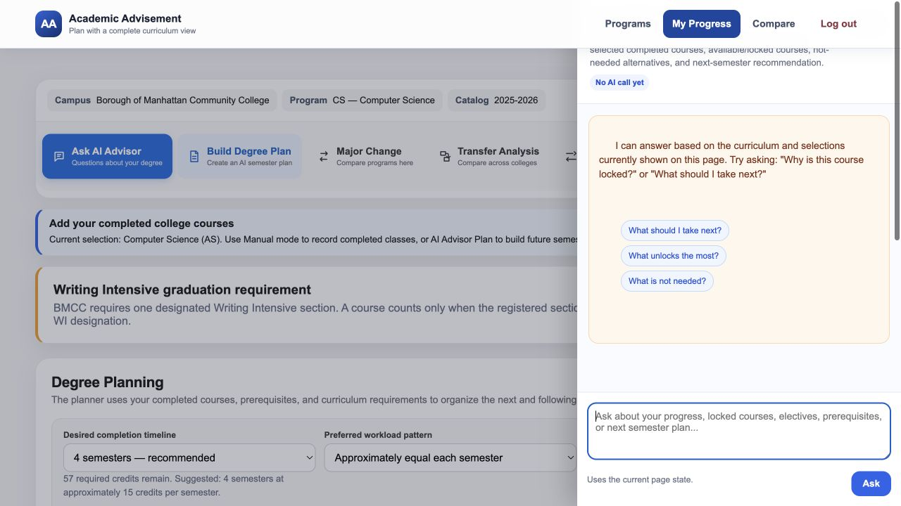

<!-- PAGEBREAK -->

## 19. Explore a major change

Use **Major Change** when considering another program at the current college.

1. Save or download the current plan if needed.
2. Start major-change comparison from the progress workspace.
3. Choose the possible destination major.
4. Review completed courses that apply, courses that do not apply, and items requiring review.
5. Compare remaining credits and prerequisite sequences.
6. Discuss the result with an advisor before changing your official major.

A what-if analysis does not change the official student record. Catalog year, admission rules, concentration requirements, and departmental approval can affect the real outcome.

<!-- PAGEBREAK -->

## 20. Explore a transfer scenario

Transfer analysis compares selected completed courses with a destination program at another institution.

1. Complete the current-program course selections first.
2. Start **Transfer Analysis** from the progress workspace.
3. Choose the destination campus and program.
4. Review direct equivalencies, combination equivalencies, unmatched courses, and warnings.
5. Open cited official sources where available.
6. Confirm uncertain results with the destination college.

If the comparison page reports that no progress snapshot exists, return to **My Progress**, select completed courses, and start the comparison again.

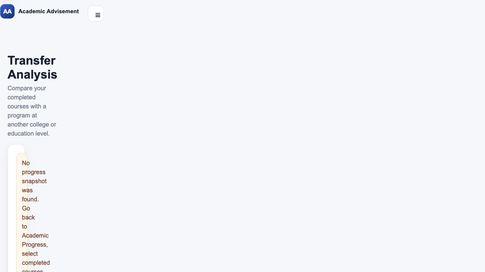

<!-- PAGEBREAK -->

## 21. Troubleshooting and responsible use

**A course is gray even though I completed it.** Check whether you selected its prerequisite, whether an alternative already satisfies the requirement, and whether the course is reserved elsewhere.

**My progress percentage looks wrong.** Verify the campus, program, concentration, catalog year, completed courses, electives, and Writing Intensive confirmation. Report a curriculum-data issue if the official source disagrees.

**The plan leaves credits unplaced.** Extend the timeline, complete prerequisite selections, and choose required electives.

**The AI request fails.** Continue with manual tools. The server may not have a Gemini key or may be temporarily unavailable.

**I found a policy exception.** Do not manipulate selections to imitate it. Document the exception and ask an advisor or curriculum administrator.

<!-- PAGEBREAK -->

## 22. Advising appointment checklist

Before meeting an advisor:

- Confirm the correct campus, program, concentration, and catalog year.
- Enter completed coursework from a reliable record.
- Identify transfer courses that still need evaluation.
- Open every unresolved locked-course explanation.
- Choose tentative electives without exceeding limits.
- Review category progress and Writing Intensive status.
- Generate a realistic workload plan.
- Download the PDF.
- Write down questions about substitutions, availability, admission rules, and graduation.

The strongest use of the platform is collaborative: the system organizes known curriculum rules, while the student and advisor resolve individual circumstances.

<!-- PAGEBREAK -->

## Quick reference

| Goal | Where to go | What to verify |
|---|---|---|
| Choose a major | Programs | Campus, concentration, catalog year |
| Enter prior coursework | My Progress | Completed, not planned courses |
| Choose a Core course | Choose courses dialog | Adjustment note, credits, enabled state |
| Check completion | Progress control | Each category and WI status |
| Build a plan | AI Degree Plan | Timeline, workload, prerequisites, placeholders |
| Save the plan | Download / Save PDF | Filename and generation date |
| Compare another major | Major Change | Applied, unused, and review-needed credits |
| Compare another college | Transfer Analysis | Official equivalencies and warnings |
| Ask a curriculum question | AI Advisor | Current page context and source limits |

Always confirm final academic decisions with an authorized advisor.
